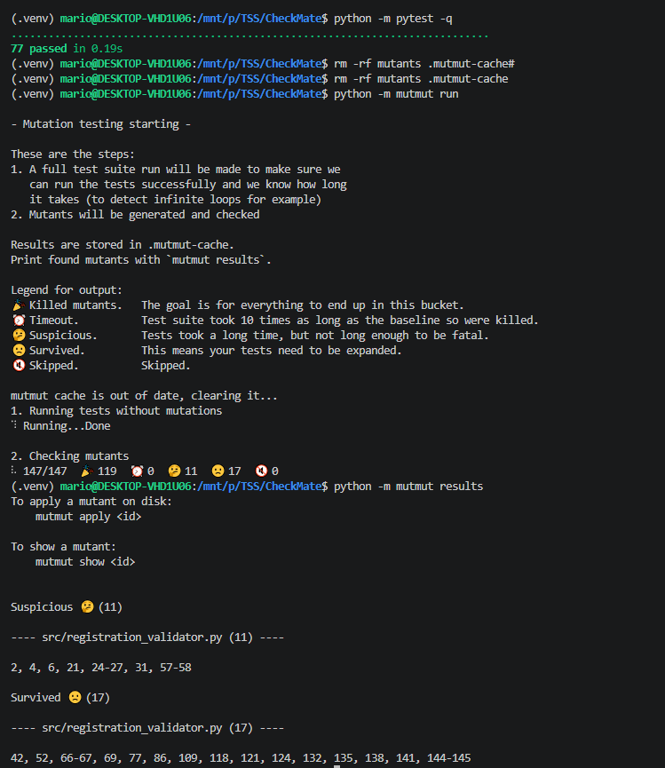
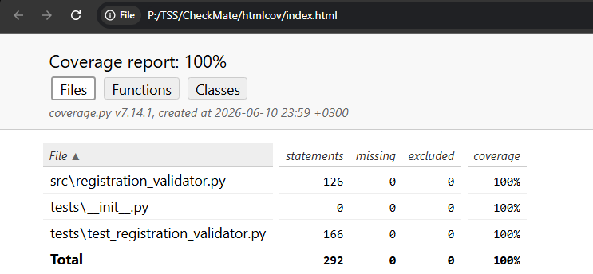
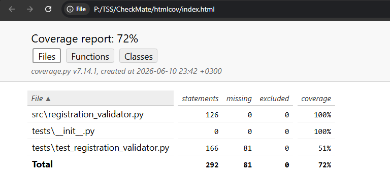
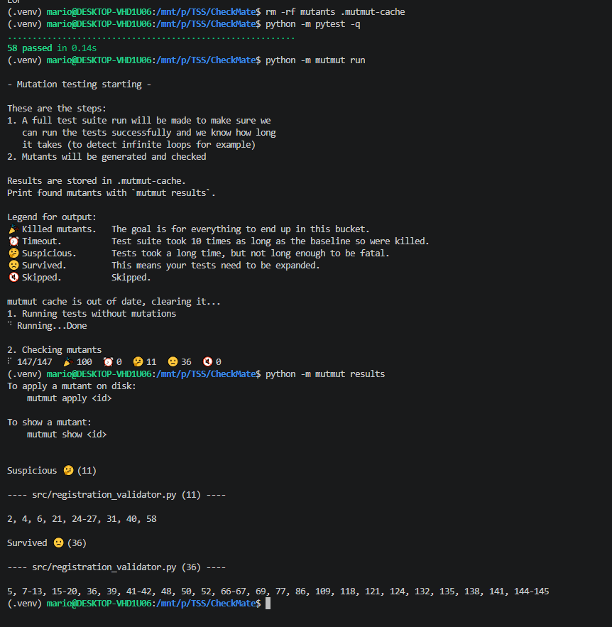
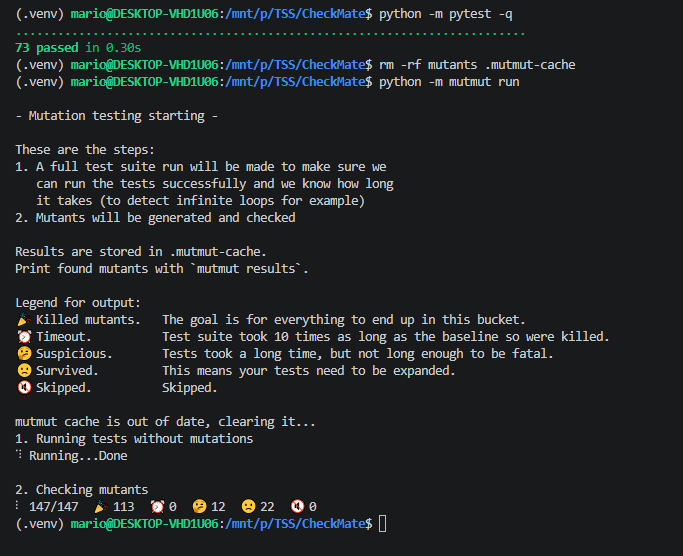
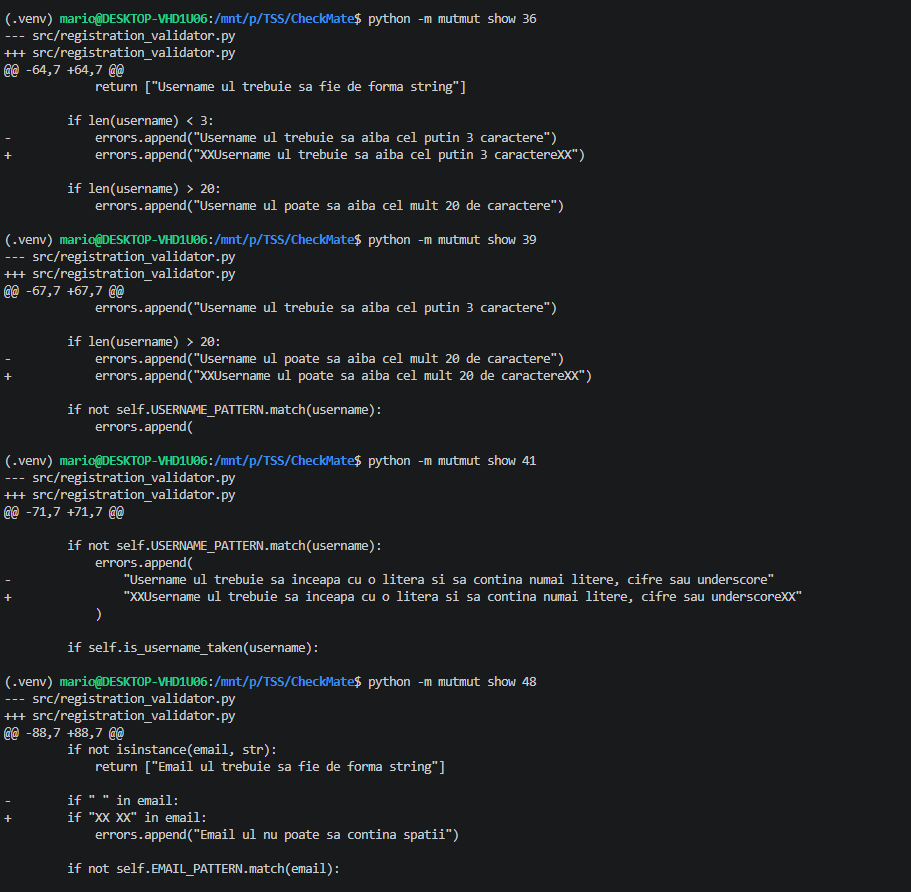
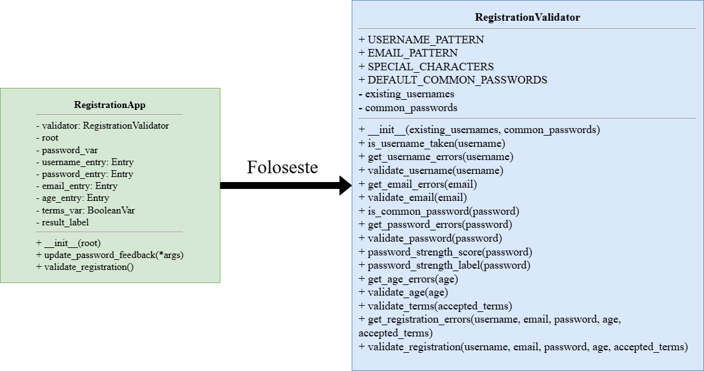
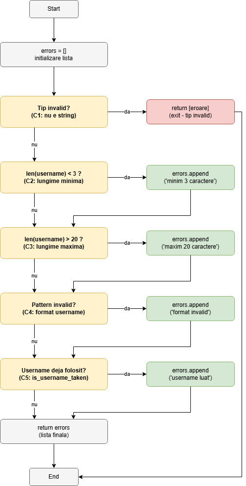
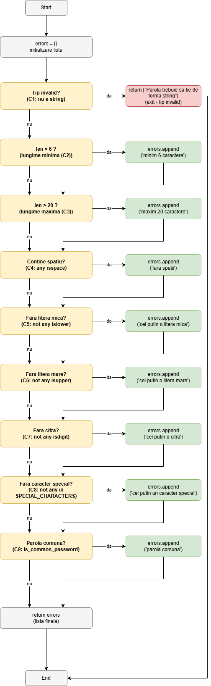
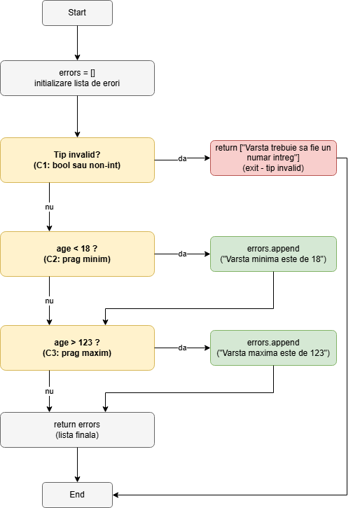

# CheckMate - Registration Validator

## Descriere

CheckMate este un proiect Python pentru validarea datelor introduse intr-un formular de inregistrare. Aplicatia verifica username-ul, email-ul, parola, varsta si acceptarea termenilor si conditiilor.

Proiectul include si o interfata grafica simpla realizata cu `tkinter`, prin care utilizatorul poate introduce datele si poate primi feedback direct despre validitatea lor. Logica principala se afla in clasa `RegistrationValidator`, iar aceasta este testata separat cu `pytest`.

## Date proiect

- Disciplina: Testarea sistemelor software
- Tema aleasa: T1 - Testare unitara in Python
- Voinea Mario
- Grupa 464
- Link repository: (https://github.com/BulgyCord/CheckMate)

## Cerinte urmarite

Tema T1, presupune sa se foloseasca un framework de testare unitara din Python pentru testarea functionalitatilor unei clase si sa ilustreze strategiile de generare a testelor.

In acest proiect, clasa testata este:

```text
src/registration_validator.py - RegistrationValidator
```

Framework-ul de testare folosit este:

```text
pytest
```

Fisierul de teste este: 

```text
tests/test_registration_validator.py
```
Strategiile acoperite in proiect sunt:

- partitionare in clase de echivalenta;
- analiza valorilor de frontiera;
- acoperire la nivel de instructiune;
- acoperire la nivel de decizie;
- acoperire la nivel de conditie;
- acoperire pe circuite independente;
- analiza raportului generat de un tool de mutation testing;
- adaugarea de teste suplimentare pentru omorarea unor mutanti neechivalenti ramasi in viata.

## Functionalitati

Aplicatia valideaza urmatoarele campuri:

- `username`
  - trebuie sa fie string;
  - trebuie sa aiba intre 3 si 20 de caractere;
  - trebuie sa inceapa cu o litera;
  - poate contine doar litere, cifre si underscore;
  - nu trebuie sa fie deja folosit.

- `email`
  - trebuie sa fie string;
  - trebuie sa respecte un format valid;
  - nu trebuie sa contina spatii.

- `password`
  - trebuie sa fie string;
  - trebuie sa aiba intre 6 si 20 de caractere;
  - trebuie sa contina cel putin o litera mica;
  - trebuie sa contina cel putin o litera mare;
  - trebuie sa contina cel putin o cifra;
  - trebuie sa contina cel putin un caracter special;
  - nu trebuie sa contina spatii;
  - nu trebuie sa fie o parola comuna.

- `age`
  - trebuie sa fie numar intreg;
  - trebuie sa fie intre 18 si 123.

- `accepted_terms`
  - trebuie sa fie `True`.

Aplicatia calculeaza si un scor pentru puterea parolei, intre 0 si 5, apoi returneaza una dintre etichetele:

- `slaba`;
- `medie`;
- `puternica`.

## Structura proiectului

```text
CheckMate/
├── docs/
│   ├── coduri/
│   │   ├── mutant1.txt
│   │   ├── mutant2.txt
│   │   └── mutant3.txt
│   ├── diagrams/
│   └── screenshots/
│       ├── Mutanti3.png
│       ├── mutanti2.png
│       ├── mutanti2rezultate.png
│       ├── primii_mutanti.png
│       ├── raportcoveragefinal.png
│       ├── raporthtmlcoverage.png
│       └── teste_trecute_framework.png
├── src/
│   ├── __init__.py
│   ├── interfata.py
│   └── registration_validator.py
├── tests/
│   ├── __init__.py
│   └── test_registration_validator.py
├── pytest.ini
├── requirements.txt
├── setup.cfg
└── README.md
```

## Tehnologii folosite

- Python 3.13
- `tkinter` pentru interfata grafica
- `pytest` pentru testare automata
- `coverage` pentru masurarea acoperirii codului
- `mutmut` pentru mutation testing

## Configuratie hardware si software

Configuratia folosita pentru dezvoltare si rulare:

| Componenta | Valoare |
|------------|---------|
| Sistem de operare | Windows 10|
| Limbaj | Python 3.13 |
| Mediu virtual | Da, `.venv` |
| Framework testare | `pytest` |
| Tool coverage | `coverage` |
| Tool mutation testing | `mutmut==2.5.1` |
| Interfata grafica | `tkinter` |
| Configuratie hardware | `Procesor Intel Core I7 Gen 12, 32GB RAM` |

Folderul `.venv` nu este inclus in repository/arhiva, deoarece este generat local si poate fi recreat folosind `requirements.txt`.

## Instalare si rulare

Pentru rularea proiectului se recomanda folosirea unui mediu virtual Python.

Crearea mediului virtual:

```powershell
python -m venv .venv
```

Activarea mediului virtual in PowerShell:

```powershell
.\.venv\Scripts\activate
```

Instalarea dependentelor:

```powershell
pip install -r requirements.txt
```

Continutul fisierului `requirements.txt` este:

```text
pytest
coverage
mutmut==2.5.1
```

Rularea interfetei grafice:

```powershell
python src/interfata.py
```

## Testare cu pytest

Testele automate se afla in fisierul:

```text
tests/test_registration_validator.py
```

Acestea verifica functionalitatile clasei `RegistrationValidator`, inclusiv:

- validarea username-ului;
- validarea email-ului;
- validarea parolei;
- calculul puterii parolei;
- validarea varstei;
- validarea acceptarii termenilor;
- validarea completa a formularului de inregistrare;
- mesajele de eroare returnate pentru input invalid.

Comanda folosita pentru rularea testelor:

```powershell
python -m pytest -q
```

Rezultatul final obtinut:

```text
77 passed
```

Captura cu rularea testelor se afla in:

```text
docs/screenshots/Mutanti3.png
```



## Strategii de generare a testelor

### Partitionare in clase de echivalenta

Partitionarea in clase de echivalenta presupune impartirea datelor de intrare in clase valide si invalide, astfel incat un caz ales dintr-o clasa sa reprezinte comportamentul acelei clase.

Exemple folosite in proiect:

| Camp | Clasa valida | Clase invalide testate |
|------|--------------|------------------------|
| Username | `andrei_123`, `abc`, `alex_test` | non-string, prea scurt, prea lung, incepe cu cifra, caractere invalide, deja folosit |
| Email | `student@example.com`, `student@mail.example.com` | non-string, fara `@`, fara extensie, cu spatii |
| Parola | `Aa1!bb` | prea scurta, prea lunga, fara litera mica, fara litera mare, fara cifra, fara caracter special, cu spatii, parola comuna |
| Varsta | `18`, `123` | sub 18, peste 123, string, float, boolean |
| Termeni | `True` | `False`, string `"True"` |

### Analiza valorilor de frontiera

Analiza valorilor de frontiera verifica valorile de la limitele intervalelor, deoarece acolo apar frecvent erori.

Exemple:

| Regula | Valori testate | Interpretare |
|--------|----------------|--------------|
| Username minim 3 caractere | 2, 3 | 2 invalid, 3 valid |
| Username maxim 20 caractere | 20, 21 | 20 valid, 21 invalid |
| Parola minim 6 caractere | 5, 6 | 5 invalid, 6 valid |
| Parola maxim 20 caractere | 20, 21 | 20 valid, 21 invalid |
| Varsta minima 18 | 17, 18 | 17 invalid, 18 valid |
| Varsta maxima 123 | 123, 124 | 123 valid, 124 invalid |

### Acoperire la nivel de instructiune

Acoperirea la nivel de instructiune urmareste executarea liniilor de cod din clasa testata. Aceasta a fost verificata cu `coverage`, iar fisierul principal `src/registration_validator.py` a obtinut acoperire de 100%.

### Acoperire la nivel de decizie

Acoperirea la nivel de decizie presupune testarea ramurilor adevarat/fals ale instructiunilor conditionale.

Exemple din proiect:

- `validate_username` returneaza `True` pentru username valid si `False` pentru username invalid;
- `validate_email` returneaza `True` pentru email valid si `False` pentru email invalid;
- `validate_password` returneaza `True` pentru parola valida si `False` pentru parole invalide;
- `validate_age` returneaza `True` pentru varsta valida si `False` pentru varsta invalida;
- `validate_terms` returneaza `True` doar cand valoarea este exact `True`.

### Acoperire la nivel de conditie

Acoperirea la nivel de conditie presupune verificarea conditiilor individuale din decizii compuse.

Exemple:

- pentru parola testam separat lipsa literei mici, lipsa literei mari, lipsa cifrei, lipsa caracterului special si prezenta spatiilor;
- pentru username am testat separat lungimea, primul caracter, caracterele permise si existenta username ului in lista celor deja folosite;
- pentru varsta am testat tipuri invalide, valoarea sub limita minima si valoarea peste limita maxima.

### Circuite independente

Prin circuite independente se inteleg trasee diferite prin logica metodei testate. In proiect am acoperit trasee separate pentru:

- inregistrare complet valida;
- inregistrare invalida din cauza username-ului;
- inregistrare invalida din cauza email-ului;
- inregistrare invalida din cauza parolei;
- inregistrare invalida din cauza varstei;
- inregistrare invalida din cauza neacceptarii termenilor;
- inregistrare cu mai multe campuri invalide simultan, verificata prin `get_registration_errors`.

## Coverage

Pentru masurarea acoperirii codului am folosit `coverage`. Configurarea din `pytest.ini` limiteaza raportarea la codul sursa din folderul `src`, deoarece scopul este sa masuram cat din codul aplicatiei este acoperit de teste, nu cat din fisierele de test a fost executat.

Configurarea folosita:

```ini
[pytest]
pythonpath = src
testpaths = tests

[coverage:run]
source = src

[coverage:report]
show_missing = True
```

Comenzile folosite:

```powershell
python -m coverage run -m pytest
python -m coverage report -m
python -m coverage html
```

Rezultatul final pentru fisierul principal al aplicatiei:

```text
src/registration_validator.py    100%
```

Acest rezultat arata ca testele acopera complet logica principala din `RegistrationValidator`.

Capturile pentru coverage se afla in:

```text
docs/screenshots/raportcoveragefinal.png
docs/screenshots/raporthtmlcoverage.png
```





## Mutation testing

Pentru mutation testing am folosit `mutmut`. Scopul a fost verificarea calitatii testelor, nu doar a procentului de coverage. Un scor mare de coverage arata ca liniile au fost executate, dar mutation testing-ul verifica daca testele detecteaza modificari gresite introduse intentionat in cod.

Configurarea pentru `mutmut` se afla in `setup.cfg`:

```ini
[mutmut]
paths_to_mutate=src/registration_validator.py
runner=python -m pytest -q
tests_dir=tests
```

Comenzile folosite:


```bash
python -m mutmut run
python -m mutmut results


Mutation testing-ul a fost rulat in WSL/Ubuntu, deoarece `mutmut` nu a rulat corect direct in Windows.


Initial, dupa prima rulare, rezultatul a fost:

```text
100 killed
11 suspicious
36 survived
```

Acest rezultat a aratat ca existau mutanti supravietuitori, deci anumite comportamente nu erau verificate suficient de testele existente.

Au fost analizati mutanti supravietuitori folosind comanda:

```md
python -m mutmut show ID_MUTANT
```

In urma analizei, au fost adaugate teste suplimentare pentru:

- detectarea tuturor parolelor comune din lista implicita;
- verificarea faptului ca litera `X` nu este tratata ca un caracter special;
- verificarea mesajelor de eroare pentru username prea scurt, username prea lung si username cu format invalid;
- verificarea mesajului de eroare pentru email cu spatii.

Dupa adaugarea acestor teste, rezultatul final a fost:

```text
147 mutanti total
119 killed
11 suspicious
17 survived
0 timeout
0 skipped
```

Evolutia rezultatelor a fost:

```text
Rulare initiala:
100 killed, 36 survived

Dupa teste suplimentare pentru parole comune si caractere speciale:
113 killed, 22 survived

Dupa teste suplimentare pentru mesaje de eroare:
119 killed, 17 survived
```

Prin aceasta evolutie se observa ca mutation testing-ul a ajutat la identificarea unor zone insuficient testate, iar testele adaugate ulterior au imbunatatit calitatea suitei de testare.

Capturile pentru mutation testing se afla in:

```text
docs/screenshots/primii_mutanti.png
docs/screenshots/mutanti2.png
docs/screenshots/mutanti2rezultate.png
docs/screenshots/Mutanti3.png
```








Codurile/iesirile analizate pentru mutanti sunt pastrate in:

```text
docs/coduri/mutant1.txt
docs/coduri/mutant2.txt
docs/coduri/mutant3.txt
```

## Comparatie rezultate

| Etapa | Pytest | Coverage `registration_validator.py` | Mutanti killed | Mutanti survived | Interpretare |
| ------|--------|--------------------------------------|----------------|------------------|--------------|
| Inainte de testele suplimentare pentru mutanti | Testele treceau | 100% | 100 | 36 | Coverage-ul era bun, dar mutation testing-ul a aratat ca unele comportamente nu erau suficient verificate |
| Dupa teste pentru parole comune si caractere speciale | Testele treceau | 100% | 113 | 22 | Au fost omorati mutanti legati de constante si validarea caracterelor speciale |
| Dupa teste pentru mesajele de eroare | 77 passed | 100% | 119 | 17 | Testele au devenit mai precise si verifica inclusiv mesaje de eroare relevante |

Concluzia comparatiei este ca `coverage` si `mutmut` masoara lucruri diferite. `coverage` arata ce linii de cod au fost executate de teste, in timp ce `mutmut` verifica daca testele pot detecta modificari gresite in cod. De aceea un coverage de 100% nu garanteaza automat ca suita de teste este suficient de puternica.

## Diagrame

Diagramele au fost realizate cu diagrams.net / draw.io. Fișierele `.drawio` sunt păstrate în `docs/diagrams/` ca surse editabile, iar imaginile `.png` sunt folosite pentru afișarea în documentație.

### Diagrama de clase

Această diagramă prezintă relația dintre clasa `RegistrationApp`, care gestionează interfața grafică, și clasa `RegistrationValidator`, care conține logica principală de validare testată cu `pytest`.



### Diagrama de activitate - validarea username-ului

Această diagramă descrie fluxul metodei `get_username_errors(username)`. Sunt reprezentate condițiile pentru tip invalid, lungime minimă, lungime maximă, format invalid și username deja folosit.



### Diagrama de activitate - validarea parolei

Această diagramă descrie fluxul metodei `get_password_errors(password)`. Sunt reprezentate verificările pentru lungime, spații, literă mică, literă mare, cifră, caracter special și parolă comună.



### Diagrama de activitate - validarea vârstei

Această diagramă descrie fluxul metodei `get_age_errors(age)`. Sunt reprezentate verificările pentru tip invalid, vârstă sub 18 ani și vârstă peste 123 de ani.



## Utilizarea unui tool AI in testare

Pentru realizarea si imbunatatirea testelor unitare am folosit ChatGPT ca tool AI de asistare. Testele au fost dezvoltate iterativ: mai intai a fost construita o suita initiala pentru functionalitatile clasei `RegistrationValidator`, apoi aceasta a fost imbunatatita si ulterior actualizata dupa rularea tool-ului de mutation testing `mutmut`.

Raportul se afla aici: [Raport AI](docs/raport_ai.md).

## Demo si prezentare

https://1drv.ms/p/c/5dcd896d88d7bfe2/IQBj1sZYSDyFTrLLV20xtcgiAYVKnjg6ukiDiHoFSN_ypjo?e=kAkK55

## Referinte

[1] Python Software Foundation, Python documentation, https://docs.python.org/3/

[2] Pytest documentation, https://docs.pytest.org/

[3] Coverage.py documentation, https://coverage.readthedocs.io/

[4] Mutmut documentation, https://mutmut.readthedocs.io/

[5] OpenAI, ChatGPT, https://chatgpt.com/


## Concluzii

Proiectul CheckMate implementeaza o componenta de validare pentru un formular de inregistrare si demonstreaza folosirea mai multor tehnici de testare:

- testare unitara cu `pytest`;
- masurarea acoperirii codului cu `coverage`;
- verificarea calitatii testelor prin mutation testing cu `mutmut`.

Rezultatul de `77 passed` confirma ca toate testele automate trec. Raportul de coverage arata ca logica principala din `RegistrationValidator` este acoperita 100%. Mutation testing-ul a evidentiat mutanti supravietuitori, iar dupa analiza acestora au fost adaugate teste suplimentare care au crescut numarul de mutanti omorati de la 100 la 119 si au redus numarul de mutanti supravietuitori de la 36 la 17.

Astfel, proiectul nu se limiteaza doar la obtinerea unui procent mare de coverage, ci demonstreaza si imbunatatirea efectiva a calitatii testelor prin analiza mutantilor.
